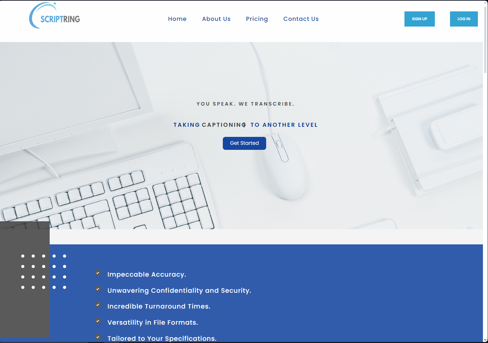
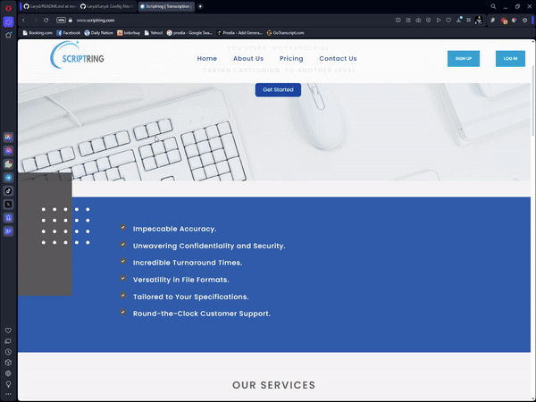
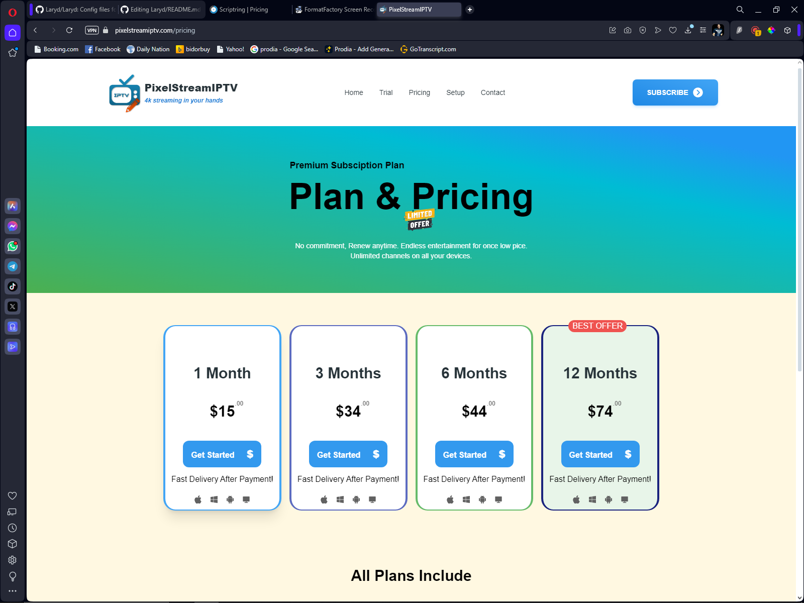

# Hillary Muboka 🚀

Hey there! 👋 I'm Hillary Muboka, a passionate full-stack developer on a journey to turn coffee into code. Welcome to my corner of the digital universe! 🌐✨
<!-- Centered GIF -->
 

  
  

## 👨‍💻 About Me

- 🌟 Full Stack Developer with a love for crafting clean and efficient code.
- 💡 Constantly exploring new technologies to stay on the cutting edge.
- 🚀 Enthusiastic about building scalable and innovative solutions.

---

### 🧰 Tools

         

          

---
        
## 🌐 Notable Projects

### Scriptring.com

Scriptring.com is a cutting-edge audio and video transcription platform that allows transcribers to seamlessly convert multimedia content into accurate and readable text. It is a comprehensive web application built in Next.js that offers audio and video transcription services, featuring a secure user authentication system with role-based access control.
Key features include:

- **Efficient Transcription:** Advanced transcription technologies ensure high-quality and efficient conversion of audio and video files.
- **User-Friendly Interface:** An intuitive and user-friendly platform, making transcription tasks easy and accessible.
- **Customization Options:** Tailor the transcription process with customizable settings to meet diverse user needs.
- <a href="https://www.scriptring.com" target="_blank">www.scriptring.com</a>
- Uses: React.js | Next.js | Redux | Node.js | Express.js | MongoDB | GitHub Actions | Jest | Bootstrap | Styled Components | Lexical

### Pixelstreamiptv
PixelStreamIPTV is a robust web application meticulously crafted with cutting-edge technologies such as React, Node.js, and Express. Built with a sleek and intuitive interface, the platform empowers users to seamlessly subscribe to a variety of IPTV service packages. Leveraging the power of Tailwind CSS for responsive and stylish design, PixelStreamIPTV offers a modern and user-friendly experience, ensuring an immersive journey for subscribers to explore and enjoy diverse IPTV content.
- <a href="https://www.pixelstreamiptv.com" target="_blank">www.pixelstreamiptv.com</a>

###Portfolio Website 
My portfolio website, built with Next.js and Styled Components, is a testament to my proficiency in full-stack development. This platform not only highlights my skills in frontend technologies but also showcases my expertise in backend development. With a seamless integration of design aesthetics through Styled Components, the website offers a visually appealing and user-friendly experience. Explore various projects via direct links, providing a comprehensive view of my diverse skill set and contributions across the full technology stack.

- <a href="https://portfolio-next-six-vert.vercel.app" target="_blank">www.hillarymuboka.netlify.app</a>

### 📫 Let's Connect!

-📧 Email: hillarymuboka@gmail.com
-🐦 X: @ghost_laryd

****
